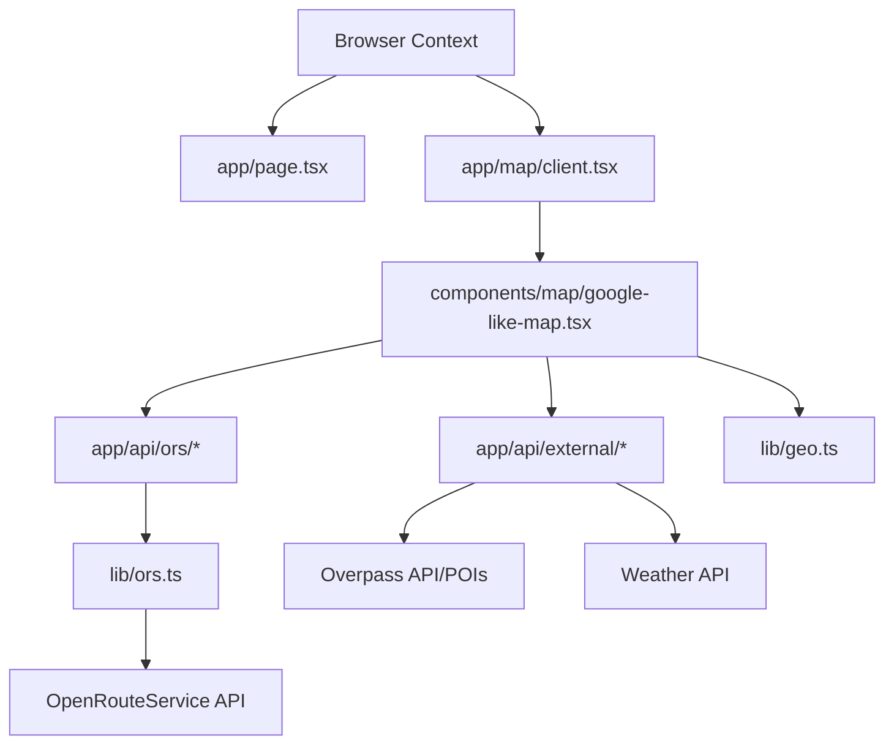

# NavKit — Responsive Map Application

> A full-stack **Next.js 15** mapping application with a Google Maps–style UI, powered by **Leaflet** on the client and **OpenRouteService (ORS)** proxied through secure server-side Route Handlers. Built with TypeScript, TailwindCSS v4, shadcn/ui, Framer Motion, and Recharts.


---

## Table of Contents

- [Overview](#overview)
- [Folder Structure](#folder-structure)
- [Directory Reference](#directory-reference)
  - [Root Configuration](#root-configuration)
  - [App Router (`app/`)](#app-router-app)
  - [API Proxy Layer (`app/api/`)](#api-proxy-layer-appapi)
  - [Interactive Maps (`app/map/`)](#interactive-maps-appmap)
  - [Shared Components (`components/`)](#shared-components-components)
  - [UI Primitives (`components/ui/`)](#ui-primitives-componentsui)
  - [Utility Modules (`lib/`)](#utility-modules-lib)
  - [Static Assets (`public/`)](#static-assets-public)
- [Tech Stack](#tech-stack)
- [Environment Variables](#environment-variables)
- [Available Scripts](#available-scripts)
- [Architecture & Dependencies](#architecture--dependencies)
- [Available API Routes](#available-api-routes)
- [Best Practices & Contributing](#best-practices--contributing)

---

## Overview

**NavKit** is a full-featured mapping application designed for high performance and extensibility. It includes:
- **Responsive Web UI**: A mobile-first, glassmorphism design with dark/light mode support.
- **Advanced Mapping**: Routing, Geocoding, Isochrones (reachability), and Matrix calculations.
- **Rich Data Overlays**: Live weather, air quality, EV charging stations, and POI searching (Restaurants, Cafes, etc.).
- **Security**: All external API keys (like `ORS_API_KEY`) are kept on the server and proxied via Next.js Route Handlers.
- **Client-Side Excellence**: Smooth animations via Framer Motion and interactive charts via Recharts.

---

## Folder Structure

```text
v0-responsive-map-app/
├── .gitignore                    # Git exclusion rules
├── components.json               # shadcn/ui configuration
├── next.config.mjs               # Next.js settings
├── package.json                  # Dependencies & scripts
├── pnpm-lock.yaml                # pnpm lockfile
├── postcss.config.mjs            # PostCSS configuration for Tailwind v4
├── tsconfig.json                 # TypeScript configuration
│
├── app/                          # Next.js App Router root
│   ├── api/                      # Server-side Route Handlers
│   │   ├── external/             # Third-party data proxies (Weather, AQI, POI)
│   │   └── ors/                  # OpenRouteService API proxies
│   ├── map/                      # Map route group (SSR disabled)
│   ├── globals.css               # Global styles & design tokens
│   ├── layout.tsx                # Root layout (Leaflet CSS, ThemeProvider)
│   └── page.tsx                  # Landing / Home page
│
├── components/                   # React components
│   ├── charts/                   # Data visualization (Elevation Chart)
│   ├── map/                      # Core Map logic (Leaflet implementations)
│   └── ui/                       # shadcn/ui atomic components
│
├── lib/                          # Utility functions & constants
│   ├── geo.ts                    # Geospatial math (Haversine, Formatting)
│   ├── ors.ts                    # ORS Client config & headers
│   └── utils.ts                  # Tailwind class merging (cn utility)
│
├── public/                       # Static public assets
└── styles/                       # Supplementary CSS files
```

---

## Directory Reference

### Root Configuration
| File | Purpose | Description |
| :--- | :--- | :--- |
| `package.json` | Project Manifest | Defines dependencies, scripts, and project metadata. |
| `next.config.mjs` | Framework Config | Customizes Next.js build behavior (images, linting, etc.). |
| `tsconfig.json` | TS Configuration | Configures the TypeScript compiler and path aliases (`@/*`). |
| `components.json` | UI CLI Config | Settings for the `shadcn/ui` CLI tool. |

### App Router (`app/`)
- **Purpose**: Defines the routing structure and global application layout.
- **Key Files**:
    - `layout.tsx`: Injects the Leaflet CSS CDN, sets up the `ThemeProvider`, and wraps the application.
    - `page.tsx`: The marketing landing page featuring an animated hero background.
- **Usage Notes**: The layout is critical for mapping; it ensures Leaflet CSS is loaded before any map components mount.

### API Proxy Layer (`app/api/`)
- **Purpose**: Securely communicates with external APIs, shielding secrets from the client.
- **Subdirectories**:
    - `ors/`: Handlers for `directions`, `geocode`, `reverse`, `isochrones`, and `matrix`.
    - `external/`: Proxies for `weather`, `air` quality, `elevation`, `ev` stations, and `poi` (Overpass API).
- **Dependencies**: Relies on `lib/ors.ts` for authentication and configuration.

### Interactive Maps (`app/map/`)
- **Purpose**: Page-level entry points for different map experiences.
- **Usage Notes**: Uses `next/dynamic` with `ssr: false` to prevent Leaflet from running on the server.

### Shared Components (`components/`)
| Directory | Purpose | Key Component |
| :--- | :--- | :--- |
| `map/` | Primary Feature Layer | `google-like-map.tsx`: The main map interface. |
| `charts/` | Data Visuals | `elevation-chart.tsx`: Elevation profile rendering. |
| Root | General UI | `site-header.tsx`: The glassmorphism navigation bar. |

### Utility Modules (`lib/`)
- **geo.ts**: Contains Haversine distance calculations and unit formatting.
- **ors.ts**: Encapsulates OpenRouteService API logic and secret management.
- **utils.ts**: Standard `cn` utility for flexible Tailwind class manipulation.

---

## Architecture & Dependencies

The following diagram illustrates how the project's components interact:



---

## Available API Routes

### OpenRouteService (Proxied)
| Route | Method | Purpose |
| :--- | :--- | :--- |
| `/api/ors/directions` | `POST` | Get turn-by-turn routing with alternatives and eco options. |
| `/api/ors/geocode` | `GET` | Search for locations and addresses with proximity bias. |
| `/api/ors/isochrones` | `POST` | Calculate travel-time polygons around a point. |
| `/api/ors/matrix` | `POST` | Generate multi-origin/multi-destination duration matrices. |

### External Enrichment
| Route | Method | Source | Purpose |
| :--- | :--- | :--- | :--- |
| `/api/external/weather` | `GET` | Open-Meteo | Real-time weather for map coordinates. |
| `/api/external/poi` | `GET` | Overpass | Search for cafes, fuel, hospitals nearby. |
| `/api/external/air` | `GET` | OpenAQ | Detailed air quality (AQI) data. |
| `/api/external/elevation` | `POST`| OpenTopoData | Elevation samples along a route. |

---

## Best Practices & Contributing

### Contributing Rules
1. **SSR Safety**: Never import Leaflet components directly. Always use dynamic imports with `{ ssr: false }`.
2. **API Security**: Do not call `api.openrouteservice.org` directly from the client. Use the `/api/ors/` proxies.
3. **Styling**: Adhere to the design tokens defined in `app/globals.css`. Use the `cn()` utility for conditional classes.
4. **Icons**: Use `lucide-react` for all iconography.

### Setup Instructions
```bash
# 1. Install Dependencies
pnpm install

# 2. Configure Environment
# Copy .env.example to .env.local and add your ORS_API_KEY
cp .env.example .env.local

# 3. Development Mode
pnpm dev
```

### Build & Verification
Always ensure the build passes before submitting changes:
```bash
pnpm build
pnpm lint
```

---

> [!TIP]
> **Extending the Project**: To add a new map layer, register a new `TileLayer` in `components/map/base-layers.ts` (if abstracted) or directly within the map component instance.
